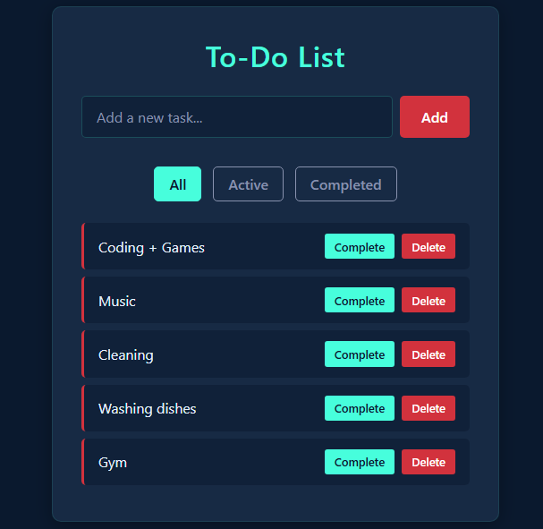
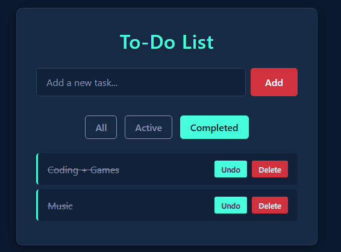
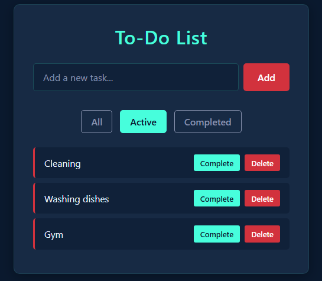

# ✅ To-Do List App

A clean, intuitive task management application built with vanilla JavaScript. Organize your daily tasks with ease!





## ✨ Features

- 📝 Add new tasks with priority levels
- ✔️ Mark tasks as complete
- 🗑️ Delete tasks
- 📅 Filter tasks (All/Active/Completed)
- 📲 Responsive design (works on all devices)
- 💾 LocalStorage integration (saves your tasks)
- 🎨 Color-coded priority system
- 🔍 Quick search functionality

## 🛠️ Technologies Used

- **Frontend**: HTML5, CSS3, JavaScript (ES6+)
- **Storage**: Browser LocalStorage
- **Styling**: CSS Grid + Flexbox
- **No dependencies**: Pure vanilla JS

## 🚀 Quick Start

1. Clone the repository:
   ```bash
   git clone https://github.com/Philani56/To-Do-List
   ```

## 🤝 Contributing

Contributions are welcome! If you have suggestions or improvements, feel free to open an issue or submit a pull request.

## 📜 License

This project is licensed under the MIT License - see the LICENSE file for details.

## 📧 Contact

For any inquiries, questions, or feedback, please reach out to:

- Email: khumalophilani580@gmail.com
- LinkedIn: https://www.linkedin.com/in/nhlakanipho-philani-khumalo-679726224/

Feel free to connect with me on social media or via email for more information!
